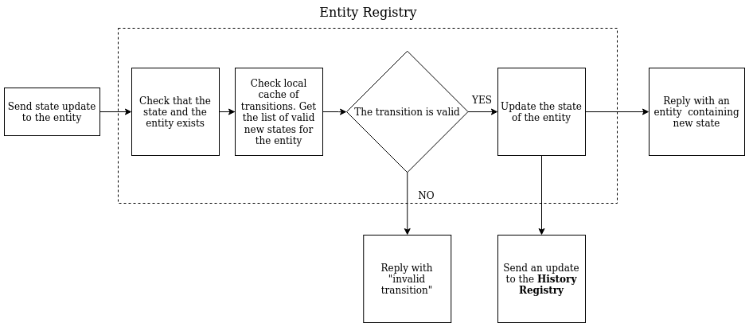
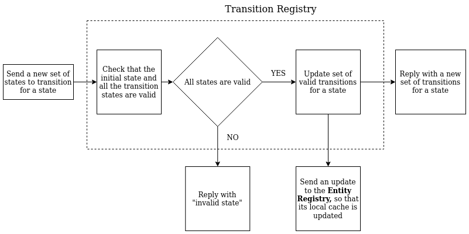

# State Manager

# Overview

The application is written in Scala with the help of Akka Actor and Akka Http frameworks. Read more details on the design of the application in the **Design** section. Below, in the **Operations** section you will find all the instructions on how to build and run the application. And **API** explains how to interact with the application when it's running.

# Operations

## Pre-requisites
In order to build and/or the application, you will need [SBT](https://www.scala-sbt.org/) installed

## Build and Run

To run the application you may simply run
```
sbt run
```

### Port configuration
You may configure application Http port changing it in the configuration file `src/main/resources/reference.conf`

```
state-manager {
  http {
    port = 8080
  }
}
```

## Docker

It is possible also to run the application inside the Docker container. Execute:

```
# to build a local image
sbt docker:publishLocal

# and run it
docker-compose up -d
```

# API

Please see the semantics for interacting with the application API below:

# GET entity
```bash
curl -X GET -H 'Accept: application/json' -i 'http://localhost:8080/entities/<entity-id>'
```

**Output:**

```
{
   "id":"<entity-id>",
   "name":"test",
   "state":"init"
}
```

# GET entities
```bash
curl -X GET -H 'Accept: application/json' -i 'http://localhost:8080/entities'
```

**Output:**

```
[{
   "id":"<entity-id>",
   "name":"test",
   "state":"init"
}]
```

# POST entity 
```bash
curl -X POST -H 'Content-Type: application/json' -H 'Accept: application/json' -i 'http://localhost:8080/entities' --data '{"name": "test", "state" : "init"}'
```

Duplicate names are accepted. One can set any initial state from the start.

**Output:**

```
{
   "id":"<entity-id>",
   "name":"test",
   "state":"init"
}
```

# Update entity state
```bash
curl -X PUT -H 'Content-Type: application/json' -H 'Accept: application/json' -i 'http://localhost:8080/entities/<entity-id>/state' --data '{"state" : "init"}'
```

Only valid states and transitions are accepted. States are: init, closed, pending, finished

**Output:**

```
{
   "id":"<entity-id>",
   "name":"test",
   "state":"init"
}
```

# Get transitions
```bash
curl -X GET -H 'Accept: application/json' -i 'http://localhost:8080/transitions'
```

**Output:**

```
{
  "init": ["pending"],
  "pending": ["finished"],
  "finished": ["closed"]
}
```

# Post state transition

```bash
curl -X POST -H 'Content-Type: application/json' -H 'Accept: application/json' -i 'http://localhost:8080/transitions' --data '{"from": "init", "to" : ["init", "closed"]}'
```

Only valid states and transitions are accepted. States are: init, closed, pending, finished

**Output:**

```
{
  "init": ["init", "closed"]
}
```

# Get transition history
```bash
curl -X GET -H 'Accept: application/json' -i 'http://localhost:8080/history'
```

**Output:**

```
[{
  "dateTime": "2020-06-13T12:09:51.135",
  "entityId": <entity-id>,
  "from": "_",
  "to": "init"
}, {
  "dateTime": "2020-06-13T12:10:39.115",
  "entityId": <entity-id>,
  "from": "init",
  "to": "closed"
}]
```

# Get transition history for an entity 
```bash
curl -X GET -H 'Accept: application/json' -i 'http://localhost:8080/entities/<entity-id>/history'
```

**Output:**

```
[{
  "dateTime": "2020-06-13T12:09:51.135",
  "entityId": <entity-id>,
  "from": "_",
  "to": "init"
}, {
  "dateTime": "2020-06-13T12:10:39.115",
  "entityId": <entity-id>,
  "from": "init",
  "to": "closed"
}]
```

# Design

In order to give a brief overview of the solution it is useful to have a look at the flows of updating the state of the entity and of creating a new state-to-state transition

## Entity state update flow


## New transition creation flow


## System components

The application is built using Akka Actor framework. And the major components of the platform are **Entity Registry**, **Transition Registry** and **History Registry** actors. Due to the nature of Actor message processing, each one of the actors will only perform one action at the time, thus ensuring thread-safe access to the resources. See their brief description below:

**Entity Registry**
Holds the list of entities of the system. It also holds a local cache of valid transitions for the states that is expected to be updated from the outside by **Transition Registry** actor. This approach allows to further progress the application to potentially separating the Transition processing logic into the separate service. Once the entity state update happens, it notifies History Registry about the performed updates.  

**Transition Registry**
Holds the list of transitions for the entity states. On the system start up and on the updates performed for the list of valid transitions, it notifies **Entity Registry**

**History Registry**
Holds the list of state transitions performed for any particular entity in the system.

## Cache expiration and update
In the current scheme of storing cache of transitions, the cache in the **Entity Registry** is being updated by the external system - **Transition Registry**. This scheme allows for the information in the cache being up-to-date as soon as the update to valid transition list happens. However, the flaw to the system is that it relies on an external communication between Transition and Entity registry actors being executed each time successfully. In further implementations it makes sense to make the local transition cache expire after the certain period of time. Then, after the expiration, an **Entity Registry** would issue a call to **Transition Registry** to receive a new transition list, thus improving fault tolerance of the system.